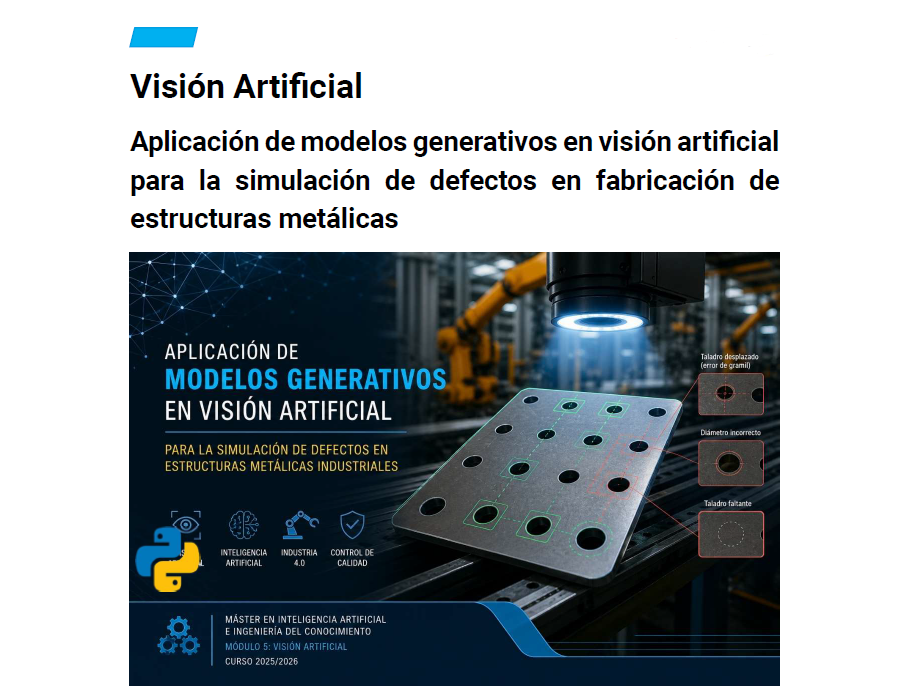
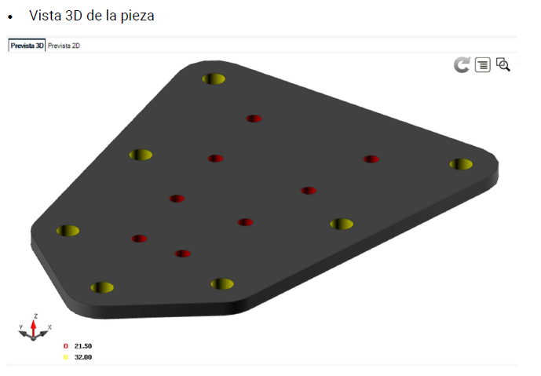
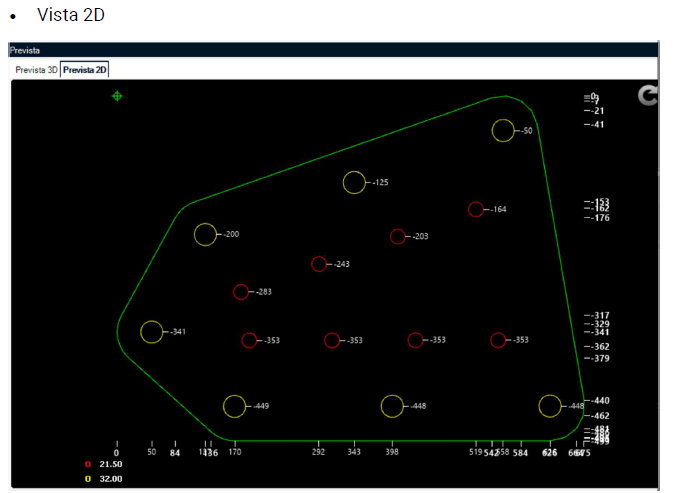
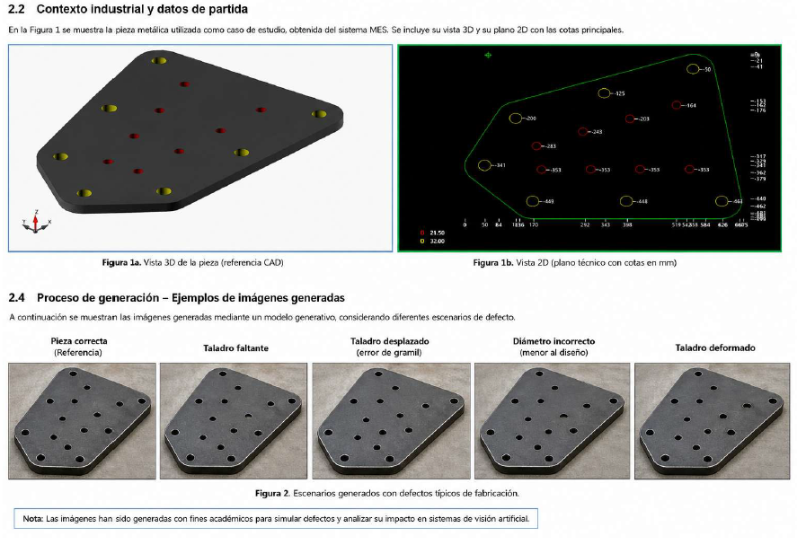

# Industrial Vision AI

Application of generative AI and computer vision concepts for industrial inspection of metal structures.

---

## Overview

This project explores how generative AI models can be applied to industrial visual inspection processes in metal structure manufacturing environments.

Using CAD-based images extracted from a MES system, synthetic defect scenarios were generated to simulate real manufacturing issues such as:

- Misaligned holes (drilling position errors)
- Incorrect diameters
- Missing holes
- Geometrical defects

The objective is not only to generate synthetic images, but also to evaluate the limitations of generative AI in industrial environments where dimensional precision is critical.

---

## Industrial Context

This project is inspired by real industrial manufacturing environments related to metal structures for power transmission and distribution lines.

In this type of production, visual inspection is essential to verify:

- Drilling positions
- Hole diameters
- Geometrical tolerances
- Cuts and assembly conditions

The inspection scenarios are based on real production challenges involving dimensional tolerances and manufacturing defects.

---

## Key Technologies & Concepts

- Computer Vision
- Generative AI
- Synthetic Data Generation
- Industrial Inspection
- Manufacturing Quality Control
- Industry 4.0
- MES / CAD-based workflows
- AI-assisted defect simulation

---

## CAD Reference

### 3D CAD Preview

### 2D Technical Drawing

---

## Generated Defect Scenarios

---

## Main Conclusion

Generative AI models can be useful for creating synthetic datasets and simulating visual defect scenarios during early development stages.

However, they cannot replace validated industrial inspection systems because they do not guarantee dimensional accuracy or compliance with real manufacturing tolerances.

---

## Documentation

The full academic report is available here:

[View full report](docs/Proyecto_Modulo5_Ricardo_Jimenez.pdf)

---

## Author

Ricardo Jiménez López

---

This project reflects the intersection between industrial software, manufacturing processes and applied artificial intelligence.
